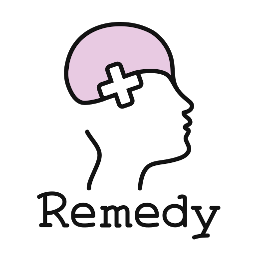
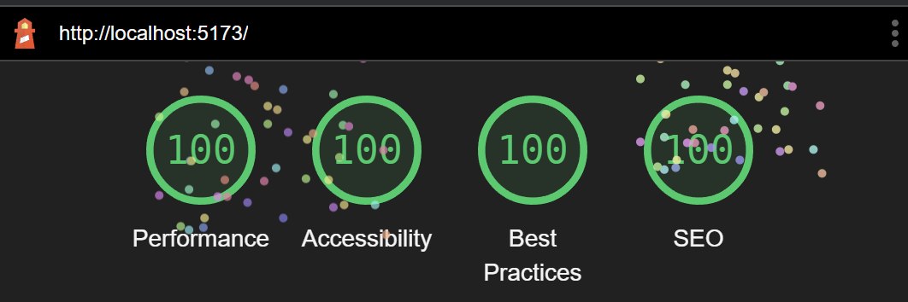

# 🍚 Remedy

Created by Aidan Gerber, Shreyas Minocha, Anthony Insalaco, and Thomas Kaldahl.

# Table of Contents
- [🍚 Remedy](#-remedy)
- [Table of Contents](#table-of-contents)
  - [⚡Quick Info](#quick-info)
  - [❓About](#about)
  - [💡Inspiration](#inspiration)
  - [📚Features](#features)
  - [🔮Potential for Growth](#potential-for-growth)
  - [🤖Techstack](#techstack)

## ⚡Quick Info
Solving urgent mental health crises: securely, intelligently, and anonymously.

## ❓About
Built in less than 36 hours, Remedy addresses barriers to accessing mental health resources at Rice. Our site enables people facing any type of mental health issue to interact with a chatbot that either directs them to either:

1. RUPD/REMS/988 in the case of a life-threatening, serious crisis;
2. an appointment with the on-campus organization best tailored to meet their specific needs; or
3. a real-time chat session with a Rice-employed mental health professional or verified student volunteer, with the option for video chat as well.

The site also includes a page which allows each user to anonymously blog about their own stories surrounding mental health. (x) AI then summarizes responses and conducts sentiment analysis.
 
 
## 💡Inspiration
University life carries with it a lot of stress. Yet, given Rice’s consistent placement at the top of the national “happiest student” rankings, many believe that mental health concerns are not relevant to our students.
 
This couldn’t be further from the truth — surveys conducted every few years indicate that Rice's student body closely follows nationwide trends in many aspects of mental health. Consequently, the university offers a plethora of resources, such as the Wellbeing Office, the Counseling Center, and Student Health Services, to address student needs when they inevitably arise.
 
Nevertheless, the characterization of Rice’s campus as one filled with the “happiest students” in the country can make seeking help from these resources feel like a stigmatizing, shameful, and isolating experience. Compounded by multiple stories of Rice student services [breaching confidentiality](https://tinyurl.com/583k5yzy) and [compelling students to unenroll](https://tinyurl.com/25tx55yu) or take time off in response to self-reported mental health concerns, the need for a streamlined and anonymous mental health resource like _Remedy_ becomes clear.
 
 
## 📚Features
   - Texting-like interface for easy and intuitive communication
   - End-to-end encryption and anonymous access.
   - Seamless video chat integration
   - Verification for mental health professionals like therapists, RHAs, and STRIVE liasons
   - Convenient access to details on all mental health resources available on campus
   - AI-enabled mental health resource bot
  
## 🔮Potential for Growth
   - Multiple language support
   - Chatbot with more accurately responses to user input for expedited resource suggestion
   - Option for users to share statistics about the type of crisis they are facing to Rice health services for more accurate mental health reporting
      
## 🤖Techstack

   - Svelte & SvelteKit (frontend)
   - Supabase (backend)
   - Web Crypto API (cryptographic primitives)
   - Tailwind & Daisy (ui & design)
   - Domain.com (domain registration & management)
   - Cloudflare (security & performance)
   - GPT-3 for natural language processing and artificial intelligence
